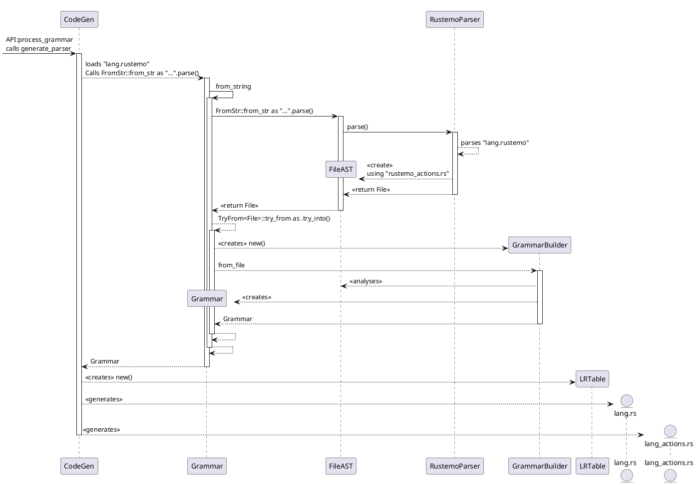
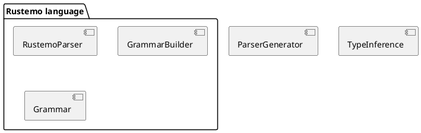

# The architecture

This section describe the main parts of Rustemo and their interplay. The purpose
of this section is to give an overview of the process, main modules and their
responsibilities.

## The parser generation (a.k.a. grammar compilation) process

The following diagram describes the process of transforming of Rustemo grammar
to a working parser. The input file is given as `lang.rustemo`. Where `lang` is
the name of the language describe by the grammar.

```admonish todo
The diagram is sligtly out-of-date. Needs update.
```




```admonish note
The above grammar assumes the default configuration. It might be slightly
different if non-defaults are used. For example, if custom builder is used type
inference and generating actions (the last step) is not performed.
```


```admonish note
Rustemo is bootstrapped using itself, thus, the above diagram describes also the
process of bootstrapping. The input grammar is `src/lang/rustemo.rustemo` and
the process generates `src/lang/rustemo.rs` which is the parser code and
`src/lang/rustemo_actions.rs` which are semantic actions for AST construction.
The actions are generated by the AST auto-generation process and manually
adapted.
```


## TODO Packages


