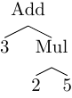

# Builders

A builder is a component that is called by the parser during the parsing process
to constructs the output.

Currently Rustemo can be configured with three builder types:

- **The default builder**

  When default builder is used, Rustemo will perform type inference for
  Abstract-Syntax Tree (AST) node types based on the grammar. The builder, AST
  types, and actions for creating instances of AST nodes will be generated.

- **Generic tree builder**

  This builder builds a tree where each node is of `TreeNode` type.

- **Custom builder**

  Is provided by the user.


## Default builder

For default builder Rustemo will generate default AST types and actions
following a certain set of rules explained in this section. The generated
builder will then call into actions to produce instances of the AST types. The
final output of this builder is AST tailored for the given grammar.

The builder will be generated, together with the parser, inside `<lang>.rs` file
where `<lang>` is the name of the grammar. The actions will be generated into
`<lang>_actions.rs` file.

```admonish note
There are two approaches where generated files are stored. See [the configuration section](./configuration.md).
```

```admonish note
[_Abstract-Syntax Tree_](https://en.wikipedia.org/wiki/Abstract_syntax_tree)
(AST) representation of the input is different from a _Concrete-Syntax Tree_
(CST, aka _the Parse Tree_). AST represents the essence of the parsed input
without the concrete syntax information.

For example, `3 + 2 * 5` represents an algebric expression where we multiply `2`
and `5` and then add product to `3`. AST should be the same no matter what is
the concrete syntax used to write down this information.



We could write the same expression in the post-fix ([Reverse Polish](https://en.wikipedia.org/wiki/Reverse_Polish_notation)) notation
like `3 2 5 * +`. CST would be different but the AST would be the same.
```

```admonish tip "Location informations"
By default, this builder do not store location information in the generated AST
types. This can be changed by `builder_loc_info` [settings](./configuration.md).
If this settings is configured then each token and generated struct type is
wrapped in [ValLoc](https://docs.rs/rustemo/latest/rustemo/struct.ValLoc.html)
type which provides `location` field and can be dereferenced to the wrapped
value.

See also [loc_info test](https://github.com/igordejanovic/rustemo/blob/main/tests/src/builder/loc_info/).
```


### AST type inference

Based on grammar rules Rustemo will infer and generate AST node types which you
can modify afterwards to suit your needs, so you can quickly have a working
parser and tune it later.

The inference is done by the following rules:

Each non-terminal grammar rule will be of an `enum` type. The enum variants will
be:
1. If only non-content matches are in the production (e.g. just string matches)
   -> plain variant without inner content
2. A single content match (e.g. regex match) or rule reference without
   assignment -> variant with referred type as its content.
3. Multiple content matches and/or assignments -> a `struct` type where fields
   types are of the referred symbols.

In addition, production kinds and assignments LHS names are used for
fields/function/type naming. Also, cycle refs are broken using `Box`.

Probably the best way to explain is by using an example. For example, if we have
the following grammar:

```
{{#include ../../examples/calculator/src/ast_actions/calculator04_ambig_lhs.rustemo}}
```

we get these generated actions/types:
```rust
{{#include ../../examples/calculator/src/ast_actions/calculator04_ambig_lhs_actions.rs}}
```

We see that each grammar rule will have its corresponding type defined. Also,
each production and each terminal will have an actions (Rust function)
generated. You can change these manually and your manual modifications will be
preserved on the next code generation as long as the name is the same.

```admonish tip
On each code generation the existing `<>_actions.rs` file is parsed using [syn
crate](https://docs.rs/syn/latest/syn/) and each type and action that is missing
in the existing file is regenerated at the end of the file while the existing
items are left untouched. The only items that cannot be preserved are non-doc
comments.

This enables you to regenerate types/actions by just deleting them from the
actions file and let rustemo run. If you want to regenerate actions/types from
scratch just delete the whole file.
```

Here is an example of generated and manually modified actions for the same grammar above:

```rust
{{#include ../../examples/calculator/src/calc_actions/calculator04_ambig_lhs_actions.rs}}
```

In these actions we are doing actual calculations. For the full explanation see
[the calculator tutorial](tutorials/calculator/calculator.md).

```admonish tip
Lexing context is passed to actions as a first parameter. This can be used to
write semantic actions which utilize lexing information like position or
surrounding content. For example, layout parser used with string lexer can use
this to construct and return a borrowed string slice which span the layout
preceding a next valid token. To be able to return a string slice, layout
actions need access to the input string and start/end positions.
```

## Generic tree builder

This is a built-in builder that will produce a generic parse tree (a.k.a
_Concrete-Syntax-Tree (CST)_).

For example, given the grammar:

```
{{#include ../../tests/src/builder/generic_tree/generic_tree.rustemo}}
```

The test:

```rust
{{#include ../../tests/src/builder/generic_tree/mod.rs:generic_tree}}
```

will produce this output:

```
{{#include ../../tests/src/builder/generic_tree/generic_tree.ast}}
```

We can see that we get all the information from the input. Each node in the tree
is a `TermNode` or `NonTermNode` variant of `TreeNode` enum. Each node keeps the
layout that precedes it.

For details see [the full
test](https://github.com/igordejanovic/rustemo/tree/main/tests/src/builder/generic_tree).

```admonish note
Generic builder can be configured by `Settings::new().builder_type(BuilderType::Generic)`
settings API, exposed through `--builder-type generic` in the [`rcomp` CLI](cli.md).
```


## Custom builders

If you have a specific requirement for the build process you can implement a
builder from scratch.

To provide a custom builder you start with a type that implements a
`rustemo::Builder` trait and after that implements a concrete parsing algorithm
trait. Currently, Rustemo is a (G)LR parser thus you can use
`rustemo::LRBuilder` trait.

Let's see how can we do all of this by implementing a builder that does
on-the-fly calculation of the arithmetic expression. Start with a type and a
base `Builder` trait implementation as each builder needs initialization and
should be able to return the final result.

```admonish note
To use a custom builder you should generate the parser with `--builder-type
custom` if using [rcomp CLI](cli.md), or calling
`rustemo_compiler::Settings::new().builder_type(BuilderType::Custom)` if
generating parser from the `build.rs` script.
```

For example, given the grammar:

```rust
{{#include ../../tests/src/builder/custom_builder/custom_builder.rustemo}}

```

in the file `custom_builder.rustemo`, the following builder from file
`custom_builder_builder.rs` will perform arithmetic operation on-the-fly (during
parsing):

```rust
{{#include ../../tests/src/builder/custom_builder/custom_builder_builder.rs:custom-builder-base}}
```

Now, implement LR part of the builder. For this we must specify what should be
done for `shift/reduce` operations:

```rust
{{#include ../../tests/src/builder/custom_builder/custom_builder_builder.rs:custom-builder-lr}}
```

And finally, you call the parser with the instance of custom builder as:

```rust
{{#include ../../tests/src/builder/custom_builder/mod.rs:custom-builder}}
```

```admonish tip
You can see the full test [here](https://github.com/igordejanovic/rustemo/tree/main/tests/src/builder/custom_builder).
```
