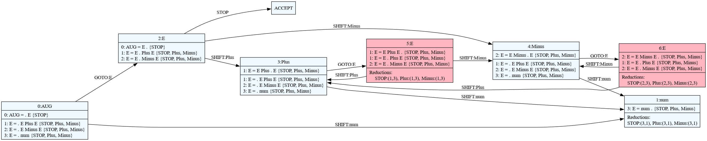

# Rustemo CLI

Crate `rustemo-compiler` installs a binary `rcomp` which is a CLI to the Rustemo
compiler.

```
cargo install rustemo-compiler
```

To get all the option of the `rcomp` you can run `rcomp --help`.

The only mandatory argument is the path to `.rustemo` file from which you want
the parser to be generated.

```
rcomp my_grammar.rustemo
```

The default lexer is a string lexer which uses [string/regex
recognizers](grammar_language.md#terminals) from the grammar.

The default builder will call auto-generated actions and [create automatically
deduced AST](builders.md#default-builder).

```admonish note
Instead of calling CLI manually you can setup your project to call the Rustemo
compiler from `build.rs` script. You can read more in the [configuration
section](configuration.md).
```

## Visualizing parser's automata

Besides providing a detailed information about the grammar and conflicts `rcomp`
can produce a diagram of the parser's handle finding automaton.

This can be used to investigate conflicts visually for smaller grammars.

E.g. for ambiguous grammar `calc.rustemo`:

```
{{#include ./images/calc.rustemo}}
```

a diagram can be produced with:

```
rcomp --dot calc.rustemo
```

and either transformed to an image with [GraphViz dot
tool](https://graphviz.org/docs/layouts/dot/) or opened directly using dot
viewers like, for example, [xdot](https://github.com/jrfonseca/xdot.py).

Here is how the diagram for the above grammar looks like. States marked with red
are states with conflicts.


