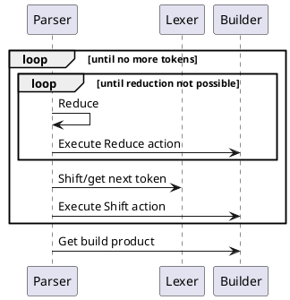

```admonish note
This docs is still work in progress and there are some parts that need to be
writen or reworked. However, the major parts are mostly finished and up-to-date
with the implementation.
```

# Introduction

Rustemo is a LR/GLR parser generator for Rust (aka
[compiler-compiler](https://en.wikipedia.org/wiki/Compiler-compiler)). 

```admonish note
Only LR is implemented at the moment. See the roadmap in the [README](https://github.com/igordejanovic/rustemo/#roadmap-tentative).
```

Basically, this kind of tools, given a formal grammar of the language, produce a
program that can transform unstructured text (a sequence of characters, or more
generally a sequence of tokens) to a structured (tree-like or graph-like) form
which is more amenable for further programmatical analysis.

One interesting feature of Rustemo is AST auto-generation, i.e. based on formal
grammar of the language Rustemo will deduce Rust types and actions used to
create and represent Abstract-Syntax Tree of your language. These types and
actions can further be incrementally manually tuned to your likings. You can
find more info in the section on the [default
builder](builders.md#default-builder).

Rustemo tries to provide sensible defaults but is made with a flexibility in
mind. Thus, you can plug-in your own builder or/and lexer.

See [the project README](https://github.com/igordejanovic/rustemo/) for
features, aspirations and the road-map.

There are multiple alternatives to this project. Some of them are listed in the
[Similar projects](https://github.com/igordejanovic/rustemo/#similar-projects)
section in the README. I advise you to check them also to be able to make an
informed decision of what approach would suit you the best.

# A usual workflow

To work with Rustemo a usual sequence of steps is as follows (after installing
`rustemo-compiler` crate):
1. Write a grammar in a textual file with `.rustemo` extension.
2. Run `rcomp` compiler (a binary installed from `rustemo-compiler` crate) with
   the given grammar to produce the parser code and optional builder actions (on
   by default).
3. Fix errors reported by `rcomp` if any and repeat from step 2 until there is
   no errors.
4. Call `parse` method from the generated parser with the input you want to
   parse.
   
Instead of calling `rcomp` you can setup `build.rs` script to generate the
parser whenever you build your crate. You can find detailed instruction on how to call the parser from the `build.rs` script and use the generated modules in the [configuration section](configuration.md).

# Where to start?

The best place to start at the moment is [the calculator
tutorial](./tutorials/calculator/calculator.md) with a reference to the [grammar
language](grammar_language.md) section as needed.

Besides tutorial and this docs, another source of information is [integration
tests](https://github.com/igordejanovic/rustemo/tree/main/tests). Tests are
usually implemented by a grammar where Rustemo compiler is called from the
[build.rs](https://github.com/igordejanovic/rustemo/blob/main/tests/build.rs)
script. The result of the test is persisted to a `.ast` (or `.err` if error is
expected) file, if it doesn't exist, or compared with the expected file if the
file exists. Be sure to check these tests as they give a good overview of the
Rustemo possibilities.


# The parsing process

This section describes the overall parsing process and interplay of parser,
lexer and builder.



