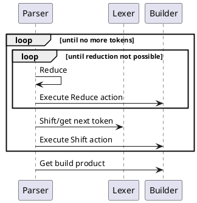

```admonish danger
This docs is still work in progress and there are still many parts just copied 
from the parglare that need to be reworked.

```

# Introduction

The best place to start at the moment is [the calculator
tutorial](./tutorials/calculator/calculator.md) with a reference to [grammar
language](grammar_language.md) as needed.

# Overview


# Quick start


# Parsing process

This section describes the overall parsing process and interplay of parser,
lexer and builder.




