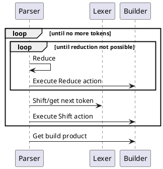

```admonish danger
This docs is still work in progress and there are some parts that need to be
writen or reworked. However, the major parts are mostly finished and up-to-date
with the implementation.
```

# Introduction

Rustemo is a LR/GLR parser generator for Rust (aka
[compiler-compiler](https://en.wikipedia.org/wiki/Compiler-compiler)). This
kind of tools you need if you want to analyze arbitrary textual files (e.g.
program files, recipes, prose) where regexes just don't cut it or to make your
own programming language.

```admonish note
Only LR is implemented at the moment. See the roadmap in the [README](https://github.com/igordejanovic/rustemo/#roadmap-tentative).
```

Basically, this kind of tools, based on some kind of declarative specification
(formal grammar), produce a program that can transform unstructured text (a
sequence of characters, or more generally a sequence of tokens) to a structured
(tree-like or graph-like) form which is easier to further analyse
programmatically.

See [the project README](https://github.com/igordejanovic/rustemo/) for
features, aspirations and the roadmap.

There are multiple alternatives to this project. Some of them are listed in
section [Similar
projects](https://github.com/igordejanovic/rustemo/#similar-projects) in the
README. I advise you to check them also to be able to make an informed decision
of what approach would suit you the best.

# Where to start?

The best place to start at the moment is [the calculator
tutorial](./tutorials/calculator/calculator.md) with a reference to [grammar
language](grammar_language.md) as needed.


# Parsing process

This section describes the overall parsing process and interplay of parser,
lexer and builder.



