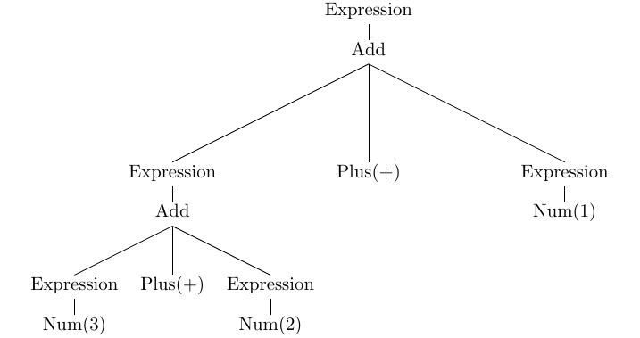
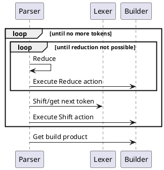

# Parsing

This section is a short refresher on the basics of parsing, and LR parsing in
particular. For a more in-depth coverage I suggest the following books:

- Dick Grune, Ceriel J.H. Jacobs: Parsing Techniques: A Practical Guide,
  Springer Science & Business Media, ISBN 0387689540, 9780387689548. 2007.
- Aho, Alfred Vaino; Lam, Monica Sin-Ling; Sethi, Ravi; Ullman, Jeffrey David
  Compilers: Principles, Techniques, and Tools (2 ed.). Boston, Massachusetts,
  USA: Addison-Wesley. ISBN 0-321-48681-1. OCLC 70775643. 2006.

There are two main approaches to parsing:

- Top-down - in which the parser starts from the root non-terminal and tries to
  predict and match sub-expressions until reaching the most basic constituents
  (tokens). This approach is used by LL(k), parser combinators, packrat etc.
- Bottom-up - in which the parser starts from the most basic constituents
  (tokens) and tries to organize them into larger and larger structures until
  eventually reaches the root non-terminal. This approach is used by LR(k)
  variants (SLR, LALR, Canonical LR) and its generalized flavor GLR.
 
Historically, the most popular flavors of parser algorithms using both
approaches were deterministic ones where the parser decides what to do by
looking at fixed number of tokens ahead (usually just one) and never backtracks.
These approaches were particularly popular due to their linear time complexity
and guaranteed unambiguity, i.e. if the input is parsed successfully there can
be exacly one representation/interpretation.

Top-down parsers are generally easier to debug and understand while bottom-up
parsers are generally more powerful as the parser doesn't need to predict
eagerly and commit in advance to what is ahead but can postpone that decision
for later when it has collected more information.

## LR parsing

LR parser uses a bottom-up approach. It takes tokens from the input and tries to
organize them into bigger constructs. The process is based on a deterministic
finite-state automata. Finite-state automata are machines that have a concept of
a state, input and action. The machine makes a transition to another state based
on the current state and the token it sees ahead (input). If for each state and
each token ahead there is only one transition possible then we say that the FSA
is deterministic (DFSA), if zero or multiple transitions are possible then we
are dealing with a non-deterministic FSA.

LR parser uses DFSA. While it can be written manually, it would be a very
tedious process and thus in practice we use compiler generators (aka compiler
compilers) to automatically produce a program that represents the DFSA (and the
rest of the LR parser) for the given grammar. Automata are usually represented
by a table used during parsing to decide the action and transition to perform.

Given a sequence of tokens, if machine starts in a start state and end-up in an
accepting state, we say that the sequence of tokens (a sentence) belongs to the
language recognized by the DFSA. A set of languages which can be recognized by
DFSA are called deterministic [context-free languages -
CFG](https://en.wikipedia.org/wiki/Context-free_language). NFSA can recognize a
full set of CFG. GLR parsing is based on NFSA.

Depending on the algorithm used to produce the FSA table we have different LR
variants (SLR, LALR etc.). They only differ by the table they use, the parsing
algorithm is the same.

Each state of the parser FSA is related to the grammar symbol and when a parser
reaches a particular state we can tell that the last symbol it saw is the symbol
related to the current state.

The parser also keeps a history of what it has seen so far on the parse stack.
We can think of a content of the stack as a sequence of symbols the parser saw
before reaching the current state.

At each step, based on the current state and the token ahead the parser can
perform one of the following operations:

- **Shift** - where the parser takes the token ahead, puts it on the stack and
  transition to the next state according to the table,
- **Reduce** - where the parser takes zero or more symbols from the stack and
  replaces them by another higher-level symbol. For example, if we have states
  on the stack that represent symbols sequence `Expression + Expression`, the
  parser can take these three symbols from the top of the stack and replace them
  by `Add`. For this to happen, the grammar must have a production `Add:
  Expression + Expression`. Basically, reduction operation reduce a pattern from
  the right-hand side to the symbol on the left-hand side in the grammar
  production. A decision on which reduction to perform is specified by the FSA
  table.
- **Accept** - if the parser reaches accepting state while consuming all the
  tokens from the input and reducing the parse stack to the root symbol the
  parsing succeeded.
- **Error** - If there is no action that can be performed for the current state
  and the token ahead the parser reports an error.


Let's see this in practice on the Rustemo example.

We have a simple grammar that parses expression with just `+` operation.


```
{{#include expressions/src/expressions.rustemo}}
```

```admonish note
For a full hands-on tutorial on building an expression language see [the calculator tutorial](../tutorials/calculator/calculator.md).
```

If we parse the input `3 + 2 + 1` with the parser compiled in `debug` profile
the log trace will have these messages at the position where the parser saw `3 +
2` and sees `+` ahead:

```
Context at 5[1,5]:
3 + 2--> + 1

Skipped ws: 1
Trying recognizers: [STOP, Plus]
	Recognizing STOP -- not recognized
	Recognizing Plus -- recognized
Token ahead: Plus("\"+\"" [1,6-1,7])
Stack: [
    State(0:AUG, 0..0 [0]),
    State(2:Expression, 0..1 [1,0-1,1]),
    State(4:Plus, 2..3 [1,2-1,3]),
    State(1:Num, 4..5 [1,4-1,5]),
]
```

The states on the stack give us information of what the parser saw previously.

The states represented in the log are from bottom to top. Each state has numeric
identifier, the grammar symbol and the position in both absolute and
line/column-based location.

```admonish tip
State position information are handy as they tell you where in the input text
you can find the reduced symbol. E.g. `Num` from the top of the stack above can
be found at line 1, column 4, and it extends to line 1, column 5.
```

The `AUG` state is the start state of the parser.

At the current location, the parser saw an expression, a plus token and a
number. The next thing that parser decides to do is to reduce by production
`Expression: Num`, thus replacing the top symbol on the stack `Num` with
`Expression`.

```
Reduce by production 'Expression: Num', size 1
GOTO 4:Plus -> 5:Expression
Stack: [
    State(0:AUG, 0..0 [0]),
    State(2:Expression, 0..1 [1,0-1,1]),
    State(4:Plus, 2..3 [1,2-1,3]),
    State(5:Expression, 4..5 [1,4-1,5]),
]
Current state: 5:Expression
```

Now, the parser is in the state `Expression` and the LR parsing table instructs
the parser to reduce by production `Add: Expression Plus Expression` which takes
the last three states/symbols from the stack and replace them with `Add`. Thus,
currently the parser has seen an addition:


```
Reduce by production 'Add: Expression Plus Expression', size 3
GOTO 0:AUG -> 3:Add
Stack: [
    State(0:AUG, 0..0 [0]),
    State(3:Add, 0..5 [1,0-1,5]),
]
Current state: 3:Add
```

Another reduction is done by production `Expression: Add` replacing the `Add` state at the top of the stack with `Expression`. Thus, currently the parser has seen an expression:

```
Reduce by production 'Expression: Add', size 1
GOTO 0:AUG -> 2:Expression
Stack: [
    State(0:AUG, 0..0 [0]),
    State(2:Expression, 0..5 [1,0-1,5]),
]
Current state: 2:Expression
```

Since no further reductions are possible the parser shifts the next token to the top of the stack:

```
Shifting to state 4:Plus at location [1,6-1,7] with token Plus("\"+\"" [1,6-1,7])
Context at 7[1,7]:
3 + 2 +--> 1

Skipped ws: 1
Trying recognizers: [Num]
	Recognizing Num -- recognized '1'
Token ahead: Num("\"1\"" [1,8-1,9])
Stack: [
    State(0:AUG, 0..0 [0]),
    State(2:Expression, 0..5 [1,0-1,5]),
    State(4:Plus, 6..7 [1,6-1,7]),
]
Current state: 4:Plus
```

The parser repeats the process until it reduce the whole input to the root
grammar symbol - `Expression`. At the end we can see:

```
Reduce by production 'Expression: Add', size 1
GOTO 0:AUG -> 2:Expression
Stack: [
    State(0:AUG, 0..0 [0]),
    State(2:Expression, 0..9 [1,0-1,9]),
]
Current state: 2:Expression
Accept
```

## A tree-based interpretation

A usual interpretation of shift/reduce operations is building the parse tree.
The content of the parse stack is then interpreted as a sequence of sub-trees
where shifted token is a terminal node (a leaf of the tree) and each reduced
symbol is a non-terminal node (a non-leaf node).

For the input `3 + 2 + 1` and the grammar above the tree is:



Leaf nodes (e.g. `Plus(+)`, `Num(3)`) are created by shift operations. Non-leaf
nodes (e.g. `Add`, `Expression`) are created by reducing their child nodes.

It is now easy to see that the tree has been built bottom-up, starting from leaf
terminal and reducing up to the root symbol of the grammar. Thus we say that the
LR parsing is bottom-up.

## Building outputs

During shift/reduce operation, LR parser usually execute what we call *semantic
actions* which job is to build the parsing output. In Rustemo, these actions are
passed to a component called *builder* which is in charge of building the final
result.

The default builder will build the Abstract-Syntax Tree (AST) with Rust types
inferred from the grammar. There is also the generic tree builder. And finally,
the user can supply a custom builder. For the details see the [section on
builders](../builders.md).

# Rustemo parsing overview

The diagram bellow depict the high-level overview of the parsing process in
Rustemo:
- LR parser works in a loop.
- If there is no lookahead token the parser asks the lexer to recognize the next
  token.
- The parser do all possible reductions. For each reduction the parser calls the
  builder.
- The parser performs shift operation, calls the builder and asks the lexer to
  recognize the next token.
- The process continues until we reach the end of the input and the parser gets
  to the accept state. Otherwise we report an error.



# GLR parsing
GLR is a generalized version of LR which accepts a full set of CFG. If multiple
parse actions can be executed at the current parser state the parser will split
and investigate each possibility. If some of the path prove wrong it would be
discarded (we call these splits - local ambiguities) but if multiple paths lead
to the successful parse then all interpretations are valid and instead of the
parse tree we get the parse forest. In that case we say that our language is
ambiguous.

Due to the fact that automata handled by GLR can be non-deterministic we say
that GLR is a form of non-deterministic parsing. See more in the [section on
resolving LR
conflicts](../handling_errors/handling_errors.md#resolving-lr-conflicts).

Rustemo uses a particular implementation of the GLR called [Right-Nulled GLR](https://www.doi.org/10.1145/1146809.1146810)
which is a correct and more efficient version of the [original GLR](https://dl.acm.org/doi/abs/10.5555/1623611.1623625).

