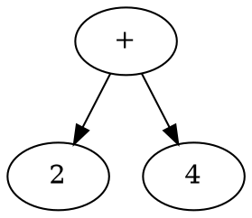

# Calculator

```admonish note
This tutorial assumes that you have Rustemo CLI properly installed. Refer to
section Installation if you have trouble running `rustemo` command.
```


In this tutorial we'll create a simple calculator with 4 arithmetic operations:
`+`, `-`, `*`, and `/`.

We would like to parse and calculate expressions like this:

```
8 + 4 / 2 - 3.2 * 2
```

```admonish note
This tutorial is rather lengthy as it covers all aspect of usage workflow, from
creating Rust project, Rustemo grammar file to implementing lexers, builders in
various ways. Thus, this should serve as a full introduction and a prerequisite for
the following tutorials as it explains the usual workflow in working with Rustemo.
```


## Create project

We assume that we are building a small demo program which accepts an expression
from the user and prints the result or informative error if the expression
doesn't conform to the grammar.

So, lets first build a new project:

```sh
cargo new --bin calculator
```
In this project we'll create a `calculator.rustemo` 

```sh
cd calculator/src
touch calculator.rustemo
```

In the rest of the tutorial we assume that grammar is written in the above
`calculator.rustemo` file.


## The grammar

To parse such expressions we start with a grammar that describe the syntax and
lexical structure of our expressions.

We start by a simple idea that each operation is binary, consisting of two
operand and an infix operator:

```
<left operand> <operator> <right operand>
```

So, let's write that down in parglare grammar notation. First, we may say that
our base expression is a single operation:

```
{{#include ./calculator/src/calculator.rustemo:1 }}
```

Our operands are numbers. Let's define lexical syntax for operands. We do that
in section starting with keyword `terminals` that should go after the main part
(syntax part) of the grammar. For lexical definition we either use plain
strings, if the content is fixed, or regular expressions, if the content is
different between lexemes. See the [section on
terminals](../grammar_language.md#terminals) for the explanation.

In this case we have numbers which differs but we can encode their structure
using regular expression:

```
{{#include ./calculator/src/calculator.rustemo:3:4 }}
```

So, our operand should have at least one digit, after which optionally follows a
dot and more digits. We could make this more elaborate but let's make it simple
for now.

And what is `operator`? It can be any of the `+`, `-`, `*`, `/` so we can encode that in regex also:

```
{{#include ./calculator/src/calculator.rustemo:5 }}
```

Symbols `+` and `*` have a special interpretation in regular expressions so we
must escape them. Symbol `/` is used to start/end the regex in rustemo so we
must escape that also.

Now, our full grammar is:

```
{{#include ./calculator/src/calculator.rustemo }}
```

If we now think about it, the only thing we could ever parse with it is a single
operation, like `3 + 4`. If we add more operations our parser built with this
grammar won't work anymore. We'll see how to extend the parser later but let's
now move on.


## Generating the parser

Let's run rustemo command to generate our parser:

```sh
rustemo calculator.rustemo
```

If you get no output there were no errors. If you made an error in the grammar
you will get a report with the line and column where the error was and what is
expected at that location.

After the parser generator is run successfully you should have files
`calculator.rs` and `calculator_actions.rs` generated.

File `calculator.rs` is the parser while `calculator_actions.rs` in default
configuration contains deduced types for the AST (_Abstract Syntax Tree_)
together with function/actions used by the builder during the parsing process to
construct the AST.

```admonish note "Regenerating the parser"
`calculator.rs` is regenerated whenever you run `rustemo` command. 

Actions in file `calculator_actions.rs`, on the other hand are not fully
regenerated. Only missing actions/type will be regenerated. This enables you to
provide manual modifications of the actions/type as long as you retain the same
name. As we shall soon see, this is a nice feature which provides a quick way to
have a working parser with default output which can be later tuned.
``` 


## Adding dependencies

Our generated parser code calls Rustemo code so we must add `rustemo-rt` crate.
Since we are using regular expressions in our grammar we also need `regex` and
`lazy_static`.

Let's add `rustemo-rt`. 

```sh
cargo add rustemo-rt --path ~/repos/rust/rustemo/rustemo-rt/
```

```admonish todo
Change previous line to install from cargo.io when published.
```

Let's add other dependencies:
```sh
cargo add regex --no-default-features --features std,unicode-perl
cargo add lazy_static
```

Your `Cargo.toml` should look like this:
```toml
{{#include ./calculator/Cargo.toml }}
```

## Running the parser

Now, let's open the `main.rs` file and write this:

```rust
{{#include ./calculator/src/main.rs }}
```

Run the program:
```
cargo run
```

This is just a reminder on how to create trees with `mdbook-graphviz`:


## Exercises

1. Support unary minus operation.
1. Extend the language to support power operator (`^`). What are priority and
   associativity of this operation?
