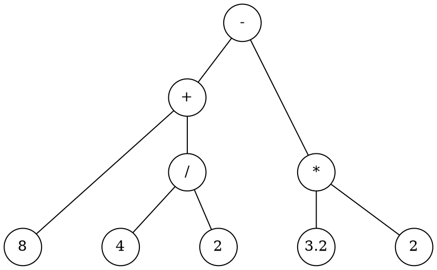

# Calculator

```admonish note
This tutorial assumes that you have Rustemo CLI properly installed. Refer to
section Installation if you have trouble running `rustemo` command.
```


In this tutorial we'll create a simple calculator with 4 arithmetic operations:
`+`, `-`, `*`, and `/`.

We would like to parse and calculate expressions like this:

```
8 + 4 / 2 - 3.2 * 2
```

```admonish note
This tutorial is rather lengthy as it covers all aspect of usage workflow, from
creating Rust project, Rustemo grammar file to implementing lexers, builders in
various ways. Thus, this should serve as a full introduction and a prerequisite for
the following tutorials as it explains the usual workflow in working with Rustemo.
```


## Create project

We assume that we are building a small demo program which accepts an expression
from the user and prints the result or informative error if the expression
doesn't conform to the grammar.

So, lets first build a new project:

```sh
cargo new --bin calculator
```
In this project we'll create a `calculator.rustemo` 

```sh
cd calculator/src
touch calculator.rustemo
```

In the rest of the tutorial we assume that grammar is written in the above
`calculator.rustemo` file.


## The grammar

To parse such expressions we start with a grammar that describe the syntax and
lexical structure of our expressions.

We start by a simple idea that each operation is binary, consisting of two
operand and an infix operator:

```
<left operand> <operator> <right operand>
```

So, let's write that down in parglare grammar notation. First, we may say that
our base expression is a single operation:

```
{{#include ./calculator1/src/calculator.rustemo:1 }}
```

Our operands are numbers. Let's define a lexical syntax for operands. We do that
in a grammar section that starts with the `terminals` keyword. This section
should go after the main part (syntax part) of the grammar. For lexical
definitions, we either use plain strings if the content is fixed, or regular
expressions, if the content is different between lexemes. See the [section on
terminals](../../grammar_language.md#terminals) for the explanation.

In this case we have numbers which differs but we can encode their structure
using regular expression:

```
{{#include ./calculator1/src/calculator.rustemo:3:4 }}
```

So, our operand should have at least one digit, after which optionally follows a
dot and more digits. We could make this more elaborate but let's make it simple
for now.

And what is the `operator`? It can be any of the `+`, `-`, `*`, `/` so we can
encode that in a regex also:

```
{{#include ./calculator1/src/calculator.rustemo:5 }}
```

Symbols `+` and `*` have a special interpretation in regular expressions so we
must escape them. Symbol `/` is used to start/end the regex in rustemo so we
must escape that also.

Now, our full grammar is:

```
{{#include ./calculator1/src/calculator.rustemo }}
```

The problem with our grammar is that the only thing we could ever parse with it
is a single operation, like `3 + 4`. If we add more operations our parser, built
with this grammar, won't work anymore. We'll see how to extend the parser later
but let's now move on.


## Generating the parser

Let's run rustemo command to generate the parser code from the grammar:

```sh
rustemo calculator.rustemo
```

If you get no output there were no errors. If you made an error in the grammar
you will get a report with the line and column where the error was and what is
expected at that location.

After the parser generator is run successfully you should have files
`calculator.rs` and `calculator_actions.rs` generated.

File `calculator.rs` is the parser while `calculator_actions.rs` in the default
configuration contains deduced types for the AST (_Abstract Syntax Tree_)
together with function/actions used by the builder during the parsing process to
construct the AST.

```admonish note "Regenerating the parser"
`calculator.rs` is regenerated whenever you run `rustemo` command. 

Actions in file `calculator_actions.rs`, on the other hand, are not fully
regenerated. Only missing actions/type will be regenerated. This enables you to
provide manual modifications of the actions/type as long as you retain the same
name. As we shall soon see, this is a nice feature which provides a quick way to
have a working parser with default AST output which can be later tuned.
``` 


## Adding dependencies

Our generated parser code calls Rustemo code so we must add `rustemo-rt` crate
as a dependency. Since we are using regular expressions in our grammar we also
need `regex` and `lazy_static`.

Let's add `rustemo-rt`. 

```sh
cargo add rustemo-rt --path ~/repos/rust/rustemo/rustemo-rt/
```

```admonish todo
Change previous line to install from cargo.io when published.
```

Let's add other dependencies:
```sh
cargo add regex --no-default-features --features std,unicode-perl
cargo add lazy_static
```

Your `Cargo.toml` should look like this:
```toml
{{#include ./calculator1/Cargo.toml }}
```

## Running the parser

Now, let's open the `main.rs` file and write this:

```rust
{{#include ./calculator1/src/main.rs }}
```

So, our initial program will accept the string from the console input, parse it
and print the result.

Run the program:
```sh
cargo run
```

You should see a prompt which expect you to enter the expression. If we enter:

```
2 + 3
```

We get debug output from the parser and at the end you should see:

```
Action: Accept
Ok(Expression { operand_1: "2", operator: "+", operand_3: "3" })
```

But if you make a mistake, like:

```
2 + / 3
```

You get:

```
Err(ParseError { message: "Error at position <str>:1:4 \"2 + -->/ 3\n\". Expected one of Operand.", file: "<str>", location: Location { start: LineBased(LineBased { line: 1, column: 4 }), end: None } })
```

Congrats! You have made your first Rustemo parser!

Although, it still have many issues which we'll fix in the rest of the tutorial.


## Extending the grammar

First, lets extend our grammar to allow for expressions of arbitrary lenght.

Let's examine expression from the beginning of the tutorial:

```
8 + 4 / 2 - 3.2 * 2
```

We can represent the expression as an Abstract Syntax Tree (AST):



These kinds of trees resemble the gist of the underlying expressions. We can observe two things:

1. AST shows the priority of operations. `*` and `/` bind stronger than `+` and
   `-`. We see that operations with higher priority will be lower in the tree.
1. Each node in the tree is a sub-expression. Numbers are most basic expressions,
   each operation is a sub-expression consisting of left sub-tree/sub-expression,
   operation and right sub-tree/sub-expression.
  
So, we could write:

```
Add: Expression '+' Expression;
Sub: Expression '-' Expression;
...
```

Where `Add`, `Sub`... are all expressions:
```
Expression: Add | Sub | ...;
```

Thus, the definition is recursive, e.g. `Add` references `Expression` through
its operands and `Expression` references `Add`.

Finally, we can write this as a single grammar rule (contracting `Expression` to `E`):

```
{{#include calculator2/src/calculator-ambig.rustemo}}
```

We can read this as:

> Expression is:
> - Expression plus Expression or 
> - Expression minus Expression
> - ...
> - or a number

```admonish note 
We must add operations to the `terminals` section for the sake of giving names
to symbols as the names are needed for the generated code.
```

Let's run `rustemo` over our new grammar to generate the parser.

```
$ rustemo 
In State 7:E
E: E Plus E .    {STOP, Plus, Minus, Mul, Div}
E: E . Plus E    {STOP, Plus, Minus, Mul, Div}
...
16 conflict(s). 16 Shift/Reduce and 0 Reduce/Reduce.
Error: Grammar is not deterministic. There are conflicts.
Parser(s) not generated.
```

Woops! What went wrong?

Rustemo is talking about some conflicts and that the grammar is not
deterministic. This just means that LR parser cannot be produced with the
grammar because LR is a deterministic style of parsing where parser must know
exactly what operation to perform in each state based solely on the next token.
With this grammar it is not possible.

The report also gives detailed information about problematic spots. The report
talks about states, those are LR automaton states as the LR parsing is based on
constructing a deterministic push-down automaton (PDA) which is used during
parsing. To learn more see ...

```admonish todo
Add links to appropriate locations where LR parsing is described.
```

In the report we see segments like this:

```
In State 10:E
E: E Div E .    {STOP, Plus, Minus, Mul, Div}
E: E . Plus E    {STOP, Plus, Minus, Mul, Div}
E: E . Minus E    {STOP, Plus, Minus, Mul, Div}
E: E . Mul E    {STOP, Plus, Minus, Mul, Div}
E: E . Div E    {STOP, Plus, Minus, Mul, Div}
When I saw E and see token Minus ahead I can't decide should I shift or reduce by production:
E: E Div E
```

Each parser state represent a location where parser can be in the parsing
process. The location is depicted by the dot in the productions above. So in
this state parser saw `E` or `E Div E` before and if there is `Minus` ahead it
won't be able to decide if it should construct a `Div` sub-tree making `Div`
operation to bind tighter or to take `Minus` symbol which follow in anticipation
to construct `Minus` sub-tree. 

Obviously, we have issue with our operations priority. Indeed, this grammar is
ambiguous and our input expression can yiled many possible trees. LR parser must
produce only one as LR parsing is deterministic.

```admonish todo
GLR parsing is non-deterministic so it can be used with ambiguous grammars. If
there are multiple interpretation GLR parser will return the parse forest which
contains all possible trees.

GLR parser is planned but Rustemo currently supports only LR.
```

This _could_ be resolved by transforming our grammar to encode priorities and
associativities but the process is tedious, the resulting grammar becomes less
readable and the resulting trees are far from intuitive to navigate and process.

Luckily, Rustemo has declarative disambiguation mechanisms which make these
issues easy to solve. These disambiguation informations are specified inside of
curly braces per production or per grammar rule. 

The priority is specified by integer number. The default priority is 10.
Productions with higher priority will be the first to be reduced (think of it as
producing a tree node).

Ok, knowing this let's extend our grammar:

```
{{#include ./calculator2/src/calculator-ambig2.rustemo}}
```

Nice, we now have priorities defined. So, in the above conflict, division will
be reduced before `Minus` is taken into consideration.

Let's run `rustemo` again:

```
$ rustemo calculator.rustemo
...
8 conflict(s). 8 Shift/Reduce and 0 Reduce/Reduce.
Error: Grammar is not deterministic. There are conflicts.
Parser(s) not generated.
```

Hm... we still have ambiguities but we've cut it in half. Let's see what are
those issues:

```
In State 10:E
E: E Div E .    {STOP, Plus, Minus, Mul, Div}
E: E . Plus E    {STOP, Plus, Minus, Mul, Div}
E: E . Minus E    {STOP, Plus, Minus, Mul, Div}
E: E . Mul E    {STOP, Plus, Minus, Mul, Div}
E: E . Div E    {STOP, Plus, Minus, Mul, Div}
When I saw E and see token Mul ahead I can't decide should I shift or reduce by production:
E: E Div E
```

Ok, now we don't have issues with priorities but we have issues with
associativities. When the parser saw division and there is multiplication symbol
ahead it doesn't know what to do. Should it favor division or multiplication?
They are of the same priority. We know that for all 4 operation parser should
favor the operation it already saw, or it should go from left to right when the
priorities are the same.

Rustemo also have declarative associativity specification. Associativity is
specified by keywords `left` (or `reduce`) and `right` (or `shift`).

Let's fix our grammar:

```
{{#include ./calculator2/src/calculator.rustemo}}
```

And run `rustemo` again.

```sh
$ rustemo calculator.rustemo
$
```

That's it! We have a working grammar. It wasn't that hard after all, was it? :)

But, the work is not over yet. We got a parser but how can we evaluate our
expressions? Read on.


## Reminder

```admonish note "Note to myself"

Trees can be created with parglare and command 

    pglr parse calc.pg -i "8 + 4 / 2 - 3.2 * 2" --dot ` (add `--glr` for ambiguous grammars)
    sed -E -e 's/number\((.*)\)/\1/g; s/(->[0-9]+)\[label.*\]/\1/g; s/dir=black,arrowtail=empty,/dir=none /g' tree.dot > tree1.dot
tree1.dot

where `calc.pg` is the following grammar:

    {{#include calc.pg}}

```

## Exercises

1. Support unary minus operation.
1. Extend the language to support power operator (`^`). What are priority and
   associativity of this operation?
