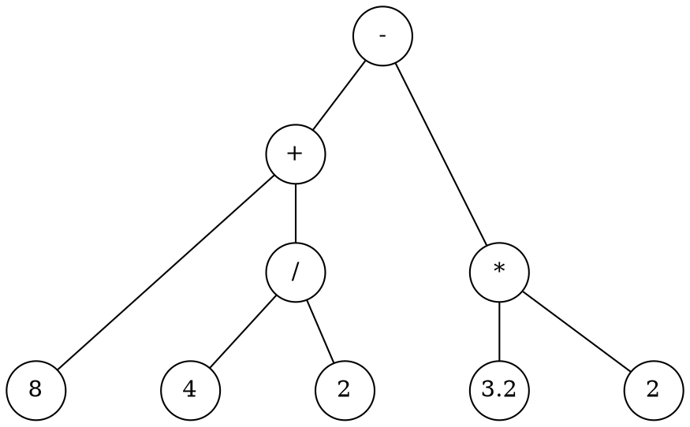

# Calculator

```admonish note
This tutorial assumes that you have Rustemo CLI properly installed. Refer to
section Installation if you have trouble running `rustemo` command.
```


In this tutorial we'll create a simple calculator with 4 arithmetic operations:
`+`, `-`, `*`, and `/`.

We would like to parse and calculate expressions like this:

```
8 + 4 / 2 - 3.2 * 2
```

```admonish note
This tutorial is rather lengthy as it covers all aspect of usage workflow, from
creating Rust project, Rustemo grammar file to implementing types and actions.
Also, this tutorial tries to be a gentle introduction providing all intermediate
steps in details. Thus, this should serve as a full introduction and a
prerequisite for the following tutorials as it explains the usual workflow in
working with Rustemo. Following tutorials will assume that the user is familiar
with the usual workflow.
```


## Create the project

We assume that we are building a small demo program which accepts an expression
from the user and prints the result or informative error if the expression
doesn't conform to the grammar.

So, lets first build a new project:

```sh
cargo new --bin calculator
```
In this project we'll create a `calculator.rustemo`

```sh
cd calculator/src
touch calculator.rustemo
```

In the rest of the tutorial we assume that grammar is written in the above
`calculator.rustemo` file.


## The grammar

To parse such expressions we start with a grammar that describe the syntax and
lexical structure of our expressions.

We start by a simple idea that each operation is binary, consisting of two
operand and an infix operator:

```
<left operand> <operator> <right operand>
```

So, let's write that down in parglare grammar notation. First, we may say that
our base expression is a single operation:

```
{{#include ./calculator1/src/calculator.rustemo:1 }}
```

Our operands are numbers. Let's define a lexical syntax for operands. We do that
in a grammar section that starts with the `terminals` keyword. This section
should go after the main part (syntax part) of the grammar. For lexical
definitions, we either use plain strings if the content is fixed, or regular
expressions, if the content is different between lexemes. See the [section on
terminals](../../grammar_language.md#terminals) for the explanation.

In this case we have numbers which differs but we can encode their structure
using regular expression:

```
{{#include ./calculator1/src/calculator.rustemo:3:4 }}
```

So, our operand should have at least one digit, after which optionally follows a
dot and more digits. We could make this more elaborate but let's make it simple
for now.

And what is the `operator`? It can be any of the `+`, `-`, `*`, `/` so we can
encode that in a regex also:

```
{{#include ./calculator1/src/calculator.rustemo:5 }}
```

Symbols `+` and `*` have a special interpretation in regular expressions so we
must escape them. Symbol `/` is used to start/end the regex in rustemo so we
must escape that also.

Now, our full grammar is:

```
{{#include ./calculator1/src/calculator.rustemo }}
```

The problem with our grammar is that the only thing we could ever parse with it
is a single operation, like `3 + 4`. If we add more operations our parser, built
with this grammar, won't work anymore. We'll see how to extend the parser later
but let's now move on.


## Generating the parser

Let's run `rustemo` command to generate the parser code from the grammar:

```sh
rustemo calculator.rustemo
```

If you get no output there were no errors. If you made an error in the grammar
you will get a report with the line and column where the error was and what is
expected at that location.

After the parser generator is run successfully you should have files
`calculator.rs` and `calculator_actions.rs` generated.

File `calculator.rs` is the parser while `calculator_actions.rs` in the default
configuration contains deduced types for the AST (_Abstract Syntax Tree_)
together with function/actions used by the builder during the parsing process to
construct the AST.

```admonish note "Regenerating the parser"
`calculator.rs` is regenerated whenever you run `rustemo` command.

Actions in file `calculator_actions.rs`, on the other hand, are not fully
regenerated. Only missing actions/type will be regenerated. This enables you to
provide manual modifications of the actions/type as long as you retain the same
name. As we shall soon see, this is a nice feature which provides a quick way to
have a working parser with default AST output which can be later tuned.
```


## Adding dependencies

Our generated parser code calls Rustemo code so we must add `rustemo` crate
as a dependency. Since we are using regular expressions in our grammar we also
need `regex` and `lazy_static`.

Let's add `rustemo`.

```sh
cargo add rustemo --path ~/repos/rust/rustemo/rustemo/
```

```admonish todo
Change previous line to install from cargo.io when published.
```

Let's add other dependencies:
```sh
cargo add regex --no-default-features --features std,unicode-perl
cargo add lazy_static
```

Your `Cargo.toml` should look like this:
```toml
{{#include ./calculator1/Cargo.toml }}
```

## Running the parser

Now, let's open the `main.rs` file and write this:

```rust
{{#include ./calculator1/src/main.rs }}
```

So, our initial program will accept the string from the console input, parse it
and print the result.

Run the program:
```sh
cargo run
```

You should see a prompt which expect you to enter the expression. If we enter:

```
2 + 3
```

We get debug output from the parser and at the end you should see:

```
Action: Accept
Ok(Expression { operand_1: "2", operator: "+", operand_3: "3" })
```

But if you make a mistake, like:

```
2 + / 3
```

You get:

```
Err(ParseError { message: "Error at position <str>:1:4 \"2 + -->/ 3\n\".
Expected one of Operand.", file: "<str>",
location: Location { start: LineBased(LineBased { line: 1, column: 4 }), end: None } })
```

Congrats! You have made your first Rustemo parser!

Although, it still have many issues which we'll fix in the rest of the tutorial.


## Extending the grammar

Ok, let's see can we parse the example expression from the beginning of the tutorial:

```
8 + 4 / 2 - 3.2 * 2
```

Run the program and give it the expression:

```sh
$ cargo run
...
Expression:
8 + 4 / 2 - 3.2 * 2
...
Err(ParseError { message: "Error at position <str>:1:6 \"8 + 4 -->/ 2 - 3.2 * 2\n\".
Expected one of STOP.", file: "<str>", location:
Location { start: LineBased(LineBased { line: 1, column: 6 }), end: None } })
```

As we already discussed above, the grammar we created so far can only parse an
expression consisting of a single operation. We can see that the parser reported
the error at the occurrence of the second operation.

Let's extend our grammar to allow for expressions of arbitrary length.

We can represent the expression as an Abstract Syntax Tree (AST):



These kinds of trees resemble the gist of the underlying expressions. We can observe two things:

1. AST shows the priority of operations. `*` and `/` bind stronger than `+` and
   `-`. We see that operations with higher priority will be lower in the tree.
1. Each node in the tree is a sub-expression. Numbers are the most basic
   expressions, each operation is a sub-expression consisting of left
   sub-tree/sub-expression, operation and right sub-tree/sub-expression.

So, we can write:

```
Add: Expression '+' Expression;
Sub: Expression '-' Expression;
...
```

Where `Add`, `Sub`... are all expressions, thus:
```
Expression: Add | Sub | Mul | Div;
```

The definition is recursive, e.g. `Add` references `Expression` through its
operands and `Expression` references `Add`.

Finally, we can write this in a more compact form as a single grammar rule
(contracting `Expression` to `E`):

```
{{#include calculator2/src/calculator-ambig.rustemo}}
```

We can read this as:

> Expression is:
> - Expression plus Expression or
> - Expression minus Expression or
> - ...
> - or a number

```admonish note
We must add operations to the `terminals` section for the sake of giving names
to symbols as the names are needed for the generated code. We can use those
terminals directly in the syntax part e.g. like:

    E: E Plus E

but I find it more readable to use strings in this case.

Of course, you can use either references or strings, or even combine the two
approaches.
```

Let's run `rustemo` over our new grammar to generate the parser.

```
$ rustemo calculator.rustemo
In State 7:E
E: E Plus E .    {STOP, Plus, Minus, Mul, Div}
E: E . Plus E    {STOP, Plus, Minus, Mul, Div}
...
16 conflict(s). 16 Shift/Reduce and 0 Reduce/Reduce.
Error: Grammar is not deterministic. There are conflicts.
Parser(s) not generated.
```

Woops! What went wrong?

Rustemo is talking about some conflicts and that the grammar is not
deterministic. This just means that LR parser cannot be produced with the
grammar because LR is a deterministic style of parsing where parser must know
exactly what operation to perform in each state based solely on the next token.
With this grammar it is not possible.

The report also gives detailed information about problematic spots. The report
talks about states, those are LR automaton states as the LR parsing is based on
constructing a deterministic push-down automaton (PDA) which is used during
parsing. To learn more see ...

```admonish todo
Add links to appropriate locations where LR parsing is described.
```

In the report we see segments like this:

```
In State 10:E
E: E Div E .    {STOP, Plus, Minus, Mul, Div}
E: E . Plus E    {STOP, Plus, Minus, Mul, Div}
E: E . Minus E    {STOP, Plus, Minus, Mul, Div}
E: E . Mul E    {STOP, Plus, Minus, Mul, Div}
E: E . Div E    {STOP, Plus, Minus, Mul, Div}
When I saw E and see token Minus ahead I can't decide should I shift or reduce by production:
E: E Div E
```

Each parser state represent a location where parser can be in the parsing
process. The location is depicted by the dot in the productions above. So in
this state parser saw `E` or `E Div E` before and if there is `Minus` ahead it
won't be able to decide if it should construct a `Div` sub-tree making `Div`
operation to bind tighter or to consume the `Minus` symbol which follows in
anticipation to construct `Minus` sub-tree first.

Obviously, we have an issue with our operation priorities. Indeed, this grammar
is ambiguous as, if we forget about priorities, input expressions can yield many
possible trees[^catalan]. LR parsers must always produce only one tree as LR
parsing is deterministic.

```admonish todo
GLR parsing is non-deterministic so it can be used with ambiguous grammars. If
there are multiple interpretation GLR parser will return the parse forest which
contains all possible trees.

GLR parser is planned but Rustemo currently supports only LR.
```

This _could_ be resolved by [transforming our grammar to encode priorities](https://stackoverflow.com/questions/39469383/how-to-do-priority-of-operations-in-my-grammars)
but the process is tedious, the resulting grammar becomes less readable and the
resulting trees are far from intuitive to navigate and process.

Luckily, Rustemo has declarative disambiguation mechanisms which makes these
issues easy to solve. These disambiguation information are specified inside of
curly braces per production or per grammar rule.

```admonish todo
Add link to meta-data/priority/associativity specification.
```

The priority is specified by integer number. The default priority is 10.
Productions with higher priority will be the first to be reduced. Think of the
reduction as producing a tree node where the node type is determined by the
left-hand side of the production while the children are right-hand side.

Ok, knowing this let's extend our grammar:

```
{{#include ./calculator2/src/calculator-ambig2.rustemo}}
```

Nice, we now have priorities defined. So, in the above conflict, division will
be reduced before `Minus` symbol (subtraction) is taken into consideration.

Let's run `rustemo` again:

```
$ rustemo calculator.rustemo
...
8 conflict(s). 8 Shift/Reduce and 0 Reduce/Reduce.
Error: Grammar is not deterministic. There are conflicts.
Parser(s) not generated.
```

Hm... we still have ambiguities but we've cut them in half. Let's see what are
those remaining issues:

```
In State 10:E
E: E Div E .    {STOP, Plus, Minus, Mul, Div}
E: E . Plus E    {STOP, Plus, Minus, Mul, Div}
E: E . Minus E    {STOP, Plus, Minus, Mul, Div}
E: E . Mul E    {STOP, Plus, Minus, Mul, Div}
E: E . Div E    {STOP, Plus, Minus, Mul, Div}
When I saw E and see token Mul ahead I can't decide should I shift or reduce by production:
E: E Div E
```

Ok, now we don't have issues with priorities but we have issues with
associativities. When the parser saw division and there is multiplication symbol
ahead it doesn't know what to do. Should it favor division or multiplication?
They are of the same priority. We know that for all 4 operation parser should
favor the operation it has already seen, or to put it simply, it should go from
left to right when the priorities are the same[^assoc].

Rustemo also have declarative associativity specification. Associativity is
specified by keywords `left` (or `reduce`) and `right` (or `shift`).

Let's fix our grammar:

```
{{#include ./calculator2/src/calculator.rustemo}}
```

And run `rustemo` again.

```sh
$ rustemo calculator.rustemo
$
```

It seems that everything is fine. Let's check by running our project:

```sh
$ cargo run
...
Expression:
8 + 4 / 2 - 3.2 * 2
...
Action: Accept
Ok(C2(EC2 { e_1: C1(EC1 { e_1: C5("8"), e_3: C4(EC4 { e_1: C5("4"), e_3: C5("2") }) })
, e_3: C3(EC3 { e_1: C5("3.2"), e_3: C5("2") }) }))

```

That's it! We have a working grammar. It wasn't that hard after all, was it? :)

But, the work is not over yet. We got a parser but the AST is not that pretty
and how can we evaluate our expressions? If you want to learn how to that read
on.

## Improving AST

When we run `rustemo` for our grammar we got two files generated:
`calculator.rs` and `calculator_actions.rs`. The first one is the parser that is
regenerated from scratch whenever we run `rustemo`. The second contains AST
nodes' types and actions used by the parser to construct AST nodes during
parsing. This file can be manually modified and the modification will be
retained when `rustemo` is run as we shall see in the next section.

At this point we shall focus on the form of AST types that Rustemo generated for
us. Open `calculator_actions.rs` file and examine its content. We can see that
for each grammar rule production we got struct generated with the name of the
grammar rule followed by `Cx` sufix (`C` for Choice and `x` is an ordinal
number).

```rust
{{#rustdoc_include calculator2/src/calculator_actions.rs:structs}}
```

```admonish tip
You can expand and see the whole code in these snippets by using "Show hidden
lines" option in the upper right corner of the code box.
```

And for each grammar rule we have an enum combining the variant structs:

```rust
{{#rustdoc_include calculator2/src/calculator_actions.rs:enum}}
```

Notice also that recursive types are boxed (e.g. `pub e_1: Box<E>;`) as they
should be.

Ok, that is nice but look at those struct names and fields. They don't give us
clue about operations, operands etc. It would be pretty hard to use these types.

Let's improve it a bit. First we can specify [production kinds]() which is just
a nice name for each production which can be used in the code.

```admonish todo
Add a link to section on production kinds.
```

We _could_ workaround the issue by making a separate grammar rule for each
operation like suggested above:

```
Add: E '+' E;
Sub: E '-' E;
...
E: Add | Sub |...
```

But let's do it with production kinds to see that alternative.

```rust
{{#include calculator3/src/calculator.rustemo}}
```

Notice the additions of `Add`, `Sub`... in the curly braces.

Regenerate the parser, but first delete actions so they can be regenerated also.

```sh
$ rm calculator_actions.rs
$ rustemo calculator.rustemo
```

Now, if we open `calculator_actions.rs` we'll see that structs are named after
productions kinds. Nice!

```rust
{{#rustdoc_include calculator3/src/calculator_actions.rs:structs}}
```

But, what about fields. It is certainly not nice to have those generic `e_1,
e_3` names. To fix these we can use [assignments]() which is a mechanism to both
define AST nodes' field names and specify to the parser what to retain in the
AST during parsing. Some parts of the input are syntax noise and should not be
kept in the AST.

```admonish todo
Add link to the section on assignments.
```

To change field names add assignments for `left` and `right` operands in each operation:

```rust
{{#include calculator4/src/calculator.rustemo}}
```

Delete actions and rerun `rustemo`. Now you'll see that the generated structs
have nicely named fields.

```rust
{{#rustdoc_include calculator4/src/calculator_actions.rs:structs}}
```
Much easier to work with!

In general, it is good to use assignments and production kinds from the
beginning as they represent valuable information (a sort of docs). The AST types
generator uses those information as you have seen.

Let's run our calculator just to make sure it works:

```sh
$ cargo run
...
Expression:
8 + 4 / 2 - 3.2 * 2
...
Action: Accept
Ok(Sub(Sub { left: Add(Add { left: C5("8"),
right: Div(Div { left: C5("4"), right: C5("2") }) }),
right: Mul(Mul { left: C5("3.2"), right: C5("2") }) }))
```

Everything is fine. Let's move on.


## Calculating expressions

The last piece of the puzzle is to make our calculator really useful by doing
the actual calculation.

When we are parsing input we are doing what we call "semantic analysis" which
purpose is to transform the input to some other form which is of use in the
domain we are working in.

Usually, the end result of the analysis is some form of AST or more often ASG
(Abstract Semantic Graph). In our case, semantic analysis can directly produce
the end result of the calculation so that the result of the full process of
parsing is a single number which represents the result.

Semantic analysis is done by the actions in `calculator_actions.rs`. The actions
are Rust functions which are called during reductions to reduce a production
(right-hand side) to the sub-result (left-hand side of the grammar rule). In our case, each reduction should basically be a calculation of a sub-expression result.

As you have seen in the previous section, you need to delete actions if you want
them regenerated on each `rustemo` run. You can also remove some parts of it and
those parts will get regenerated. The logic is that `rustemo` will only add
missing parts (identified by its name) of the file (missing AST types and action
functions) but will not modify already existing. This enables manual
modification of parts we want to tune to our likings.

We will now change types and actions to calculate sub-results instead of
building AST nodes.

First, we'll start with the `Number` rule which is defined as a `String`:

```rust
{{#include calculator4/src/calculator_actions.rs:number}}
```

We know that our number should be `float`, so change it:

```rust
{{#include calculator5/src/calculator_actions.rs:number}}
```

Just bellow the `Number` type we see the first action which is called to
transform the parsed number to `Number`. `token.value` is a string slice
containing the number.

```rust
{{#include calculator4/src/calculator_actions.rs:number_action}}
```

Previously our `Number` was `String` but now it is a float so we should change
this action to parse the string and produce a float:

```rust
{{#include calculator5/src/calculator_actions.rs:number_action}}
```

Now, we see that `E` type which represents sub-results is enum.

```rust
{{#include calculator4/src/calculator_actions.rs:expression}}
```

A sub-result should be float also. So replace the enum with:

```rust
{{#include calculator5/src/calculator_actions.rs:expression}}
```

Also, structs for values of variants `Add`, `Sum`... are not needed anymore so
remove them from the file.

Okay, we have fixed generated types, now let's see our expressions' actions.
They are of the form:

```rust
{{#rustdoc_include calculator4/src/calculator_actions.rs:add_action}}
```

So they produce AST node while they should do the calculation. So let's change all of them:

```rust
{{#rustdoc_include calculator5/src/calculator_actions.rs:actions}}
```

```admonish tip
Just a reminder that you can see the whole code by using "Show hidden lines".
```

Very simple, each action is doing its calculation! Notice the last one which
is called to reduce `Number` to `E`. It just returns the number as it is already
a float produced by the `number` action.

That's it. We have a fully working calculator!

Let's run it just to verify:

```sh
$ cargo run
...
Expression:
8 + 4 / 2 - 3.2 * 2
...
Action: Accept
Ok(3.6)
```

If you have made it through here, well done!

Now, just to make sure that you have connected all the dots try to solve
exercises bellow.

## Reminder

```admonish note "Note to myself"

Trees can be created with parglare and command

    pglr parse calc.pg -i "8 + 4 / 2 - 3.2 * 2" --dot ` (add `--glr` for ambiguous grammars)
    sed -E -e 's/number\((.*)\)/\1/g; s/(->[0-9]+)\[label.*\]/\1/g; s/dir=black,arrowtail=empty,/dir=none /g' tree.dot > tree1.dot
tree1.dot

where `calc.pg` is the following grammar:

    {{#include calc.pg}}

```

## Exercises

1. Extend the language to support power operator (`^`). What are priority and
   associativity of this operation?
1. Support unary minus operation.
1. Support trigonometric operations in a function call style (e.g. `sin(34) +
   2 * cos(12)`)
1. Support variables before an expression. E.g:
   ```
   a = 5
   b = 2 * a
   a + 2 * sin(b)
   ```

   Extend `main.rs` to accept input line-by-line. Whenever the user enter
   assignment to the variable the parser the program will update its internal
   state by evaluating RHS of the assignment and keeping variable values in some
   mapping data structure of your choice. Each defined variable can be used in
   subsequent expressions. When the user enters just an expression without
   assignment the parser should evaluate and print the result.

## Footnotes

[^catalan]: The number of trees (interpretations) of an arithmetic expression
    can be calculated by the [Catalan number
    sequence](https://en.wikipedia.org/wiki/Catalan_number). For our example
    with 4 operations from the beginning the number of trees will be 14.

[^assoc]: This doesn't hold for some other operations. See
    [Exercises](#exercises) and think about associativity of the power
    operation.
